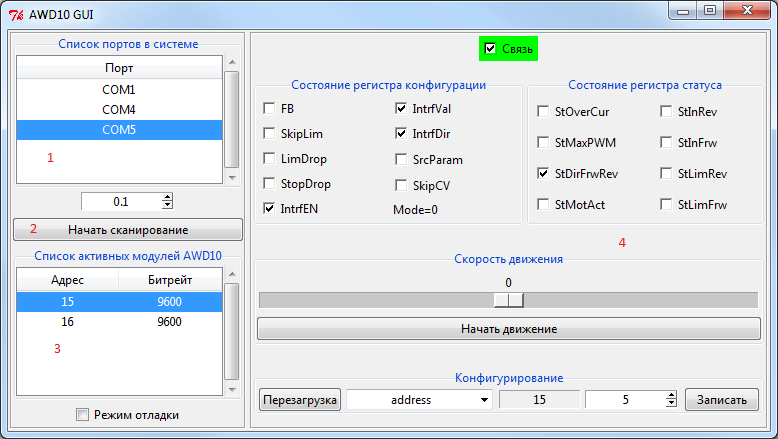

# python-awd10 #

Библиотека для работы с блоком управления коллекторным двигателем постоянного тока AWD10

## 1. Работа с консольной версией ##

    usage: awd-console [-h] --port PORT [--timeout [VALUE]] [--debug] [--scan]
                       [--unit UNIT] [--echo | --reset | --state | --get KEY |
                       --set KEY VALUE | --move SPEED | --stop | --enrot | --result KEY]

    AWD10 command-line option

    optional arguments:
    -h, --help         show this help message and exit
    --port PORT        select port name
    --timeout [VALUE]  select timeout in seconds
    --debug            print debug information

    Scanner:
    --scan             scan available modules

    User:
    --unit UNIT        select AWD10 address
    --echo             send ECHO request
    --reset            send RESET request
    --state            read AWD10 state
    --get KEY          read config value
    --set KEY VALUE    write config value
    --move SPEED       send MOVE request
    --stop             send STOP request
    --enrot            send ENROT request
    --result KEY       read result value

Программа может работать в двух режимах: **Scanner** и **User**

### Режим Scanner ###

В этом режиме происходит поиск активных модулей, подключенных к порту

Пример использования режима Scanner:

    awd-console --port COM5 --scan

Пример результата работы:

    Unit: 5 - OK

### Режим User ###

Пример использования режима User:

- Чтение регистра конфигурации режима работы блока управления

        awd-console --port COM5 --unit 5 --state

- Посылка эхо-запроса

        awd-console --port COM5 --unit 5 --echo

- Чтение значения параметра контроллера

        awd-console --port COM5 --unit 5 --get Address

- Запись значения параметра в контроллер

        awd-console --port COM5 --unit 5 --set Address 5

- Команда движения с постоянной скоростью 100 (или -100 для движения в обратную сторону)

        awd-console --port COM5 --unit 5 --move 100

- Команда окончания выполнение режима

        awd-console --port COM5 --unit 5 --stop

- Команда запуска режима слежения за внешним аналоговым сигналом (режим Сл)

        awd-console --port COM5 --unit 5 --enrot

## 2. Работа с графической версией ##

## 3. Работа с симулятором AWD10 ##

    usage: awd-simulator [-h] --port PORT --unit UNIT [--debug]

    AWD10 simulator command-line option

    optional arguments:
    -h, --help   show this help message and exit
    --port PORT  select port name
    --unit UNIT  select AWD10 address
    --debug      print debug information

Пример запуска симулятора (где COM10 - адрес виртуального порта):

    awd-simulator --port COM10 --unit 5
